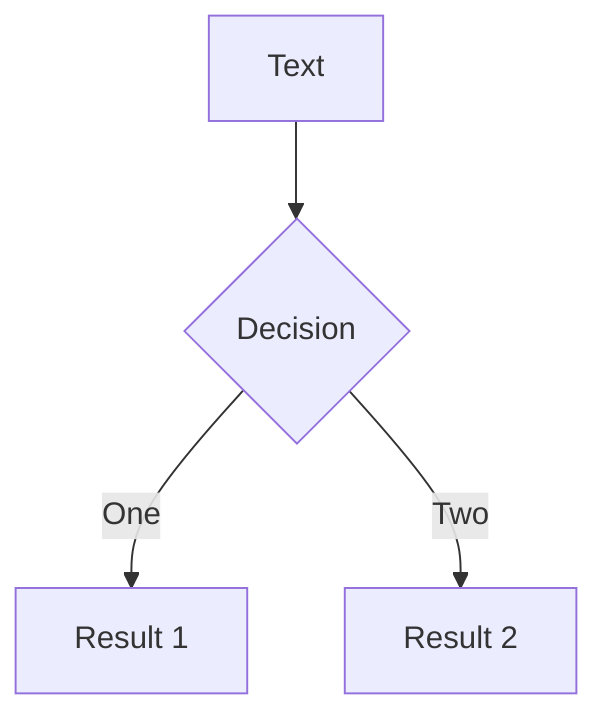

<!-- 背景画像とテキストアニメーション -->

<div
  v-motion
  :initial="{ opacity: 0, y: 50 }"
  :enter="{ opacity: 1, y: 0, transition: { delay: 500 } }"
  class="text-center text-5xl font-bold"
>
  オブジェクト指向でなぜつくるのか<br>
  読んだよ
</div>

<style>
section {
  background-image: url('https://richka.co/wp-content/uploads/2020/09/anders-jilden-uwbajDCODj4-unsplash.jpg');
  background-size: cover;
  color: #ffffff;
}
</style>

---

<div class="text-center text-5xl font-bold relative">
  
</div>
---

# 大体の内容

1. オブジェクト指向の概要
2. オブジェクト指向に至るまでの歴史
3. 具体的な技術
4. 整理術としてのオブジェクト指向
5. 応用
   - UML
   - モデリング
   - 設計
   - アジャイル開発
6. 関数型プログラミング

---

# おすすめポイント

- 優しい
  - オブジェクト指向って聞いたことあるなら読んでみて
- 章の順番がわかりやすい
- サンプルコードがわかりやすい（リーダブルコードやLaravelの本より）

---

# 自分に当てはめて

- 今までオブジェクト指向あまり意識してなかったけど...

  - supabase（ライブラリ）でインスタンス作って使い回しまくってた

- メモリ意識したことある？

  - 自分はなかった
  - メモリの使い方について初めて学んだ

- 実践とかは自分でするしかない

---

# よくわからなかったところ

- COBOLのコンパイラがCOBOL？

---

# 内容があまりそうなので

今週詰まってて解決したアホなところ紹介

- signout（supabaseのサンプルコード、フロントからsupabaseのインスタンスにアクセス）

  - signoutをbff,バックエンドを介してsupabaseのインスタンスにアクセスにする

- 処理（signout → supabase）

  - DBの処理
  - クッキーの削除

- できないこと
  - これをbff,バックエンド介すとcookieの削除ができない

---

# つまづいたところ

- 実装時の状況
  - signin,signupも同じようにしてた

```ts {2}
const app = new Hono().post("/", async (c) => {
  const cookie = getCookie(c);

  const response = await clientCore.api.core.auth.signout.$post(
    {},
    {
      headers: {
        Cookie: cookie,
      },
    }
  );
```

---

# 正解のコード

```ts {2,3}
const app = new Hono().post("/", async (c) => {
  // const cookie = getCookie(c);
  const cookie = c.req.raw.headers.get("Cookie");

  const response = await clientCore.api.core.auth.signout.$post(
    {},
    {
      headers: {
        Cookie: cookie,
      },
    }
  );
```

- `getCookie`の中身オブジェクトでした。
- ずっと送れていると思い込んでいた。

---

# どこで気がついたか

- 散々わからず一度撤退
- getUserもbffとcore噛ませるぞ！
- 同じやり方でそもそもUser取得できない
  - なんで？

---

- signinでcookieいらないのにうまくいっているってことはCookie渡せているという謎思考
  <br><br><br><br><br><br><br>

# 来週もっとちゃんとした発表します

<p v-click style="font-size: 200px;opacity:0.1">多分</p>

---

# 使い方

## インストール

```bash
npm init slidev
```

## アクセス

http://localhost:3030/1

<div class="p-5 bg-teal-600 text-white rounded-lg shadow-md mt-10">
  スライドの使い方は簡単です！
</div>
---

# 使い方その2

- slides.mdに記述
- 別ファイルをインポートしてもOK（ページごとにファイル分けれる）
  

---

# 使い方その3

`---`でページ間を区切り、あとはマークダウン


---

# コードについて

コードブロックを直接使用してハイライト表示する

```ts {2,3}
function add(a: Ref<number> | number, b: Ref<number> | number) {
  return computed(() => unref(a) + unref(b));
}
```

````
```ts {2,3}
function add(a: Ref<number> | number, b: Ref<number> | number) {
  return computed(() => unref(a) + unref(b));
}
````

編集したい場合は、monacoを使う

```ts {monaco}
console.log("HelloWorld");
```

<div v-click>
  <div class="text-lg text-red-600 mt-5">
    実際のコードをハイライトして表示できます！
  </div>
</div>

---

# 装飾

Windi CSSとVueコンポーネントを直接使用して、スライドをスタイリングし、リッチにすることができます。

<div class="p-3">
  <Tweet id="20" />
</div>

```
<div class="p-3">
  <Tweet id="20" />
</div>
```

---

# 装飾2

> Hello `world`

```
<style>
blockquote {
  code {
    @apply text-teal-500 dark:text-teal-400;
  }
}
</style>
```

<style>
blockquote {
  code {
    @apply text-teal-500 dark:text-teal-400;
  }
}
</style>

---

# 画像

リモート

``


---

# 画像

ローカル

``


---

# 図形



```
graph TD
B[Text] --> C{Decision}
C -->|One| D[Result 1]
C -->|Two| E[Result 2]
```

---

# アニメーション

<!-- コンポーネントの使い方: "次へ"を押すまで、ここから下の内容は表示されません -->
<v-click>

Hello World

</v-click>

<!-- ディレクティブの使い方: 2回目の"次へ"を押すまで、ここから下の内容は表示されません -->
<div v-click class="text-xl p-2">

Hey!

</div>
```
<!-- コンポーネントの使い方: "次へ"を押すまで、ここから下の内容は表示されません -->
<v-click>
Hello World
</v-click>
<!-- ディレクティブの使い方: 2回目の"次へ"を押すまで、ここから下の内容は表示されません -->
<div v-click class="text-xl p-2">
Hey!
</div>
```

---

# アニメーション2

<div
  v-motion
  :initial="{ x: -80 }"
  :enter="{ x: 0 }">
  Slidev
</div>

```
<div
  v-motion
  :initial="{ x: -80 }"
  :enter="{ x: 0 }">
  Slidev
</div>
```

---

#プレゼンターモード

http://localhost:3030/presenter

---

# デプロイ方法

- Netlify
- Vercel
- Github Pages

---

# Vercel

0. 設定（vercel.jsonに記述、インストール時に同時作成済み）
1. プロジェクト作成
2. リポジトリ連携
3. 完了

---

<div style="
position:absolute;
left:50%;
top:50%;
z-index:100;
font-size:100px
">

Fin.

</div>
